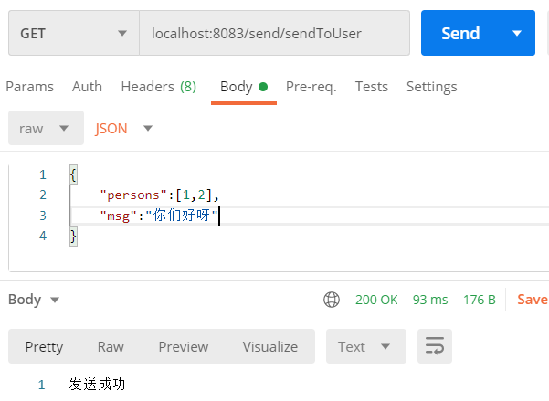
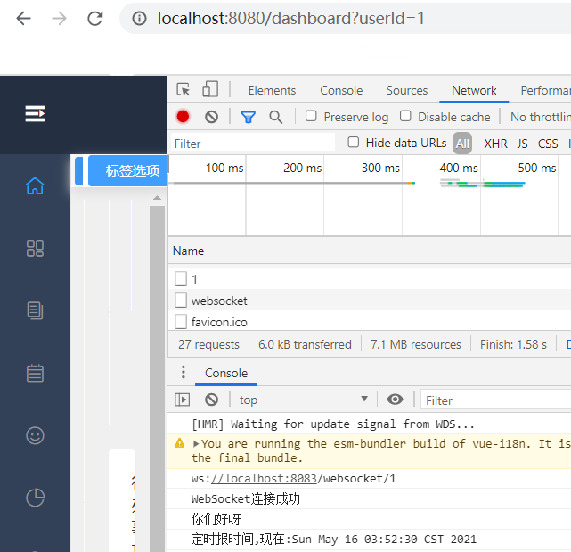
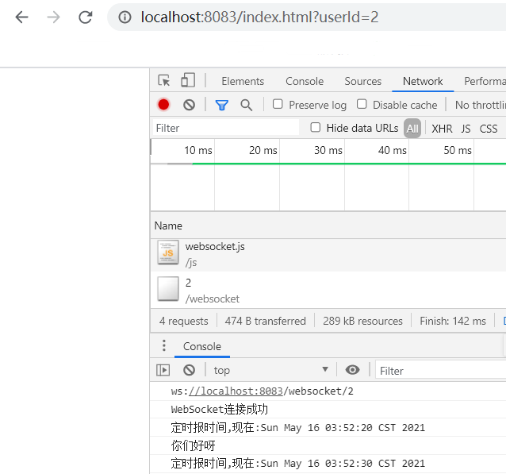
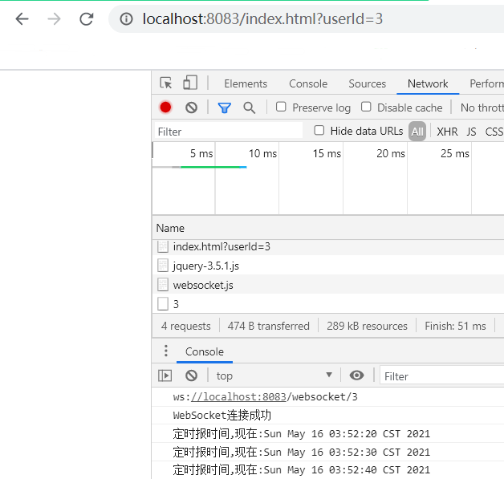
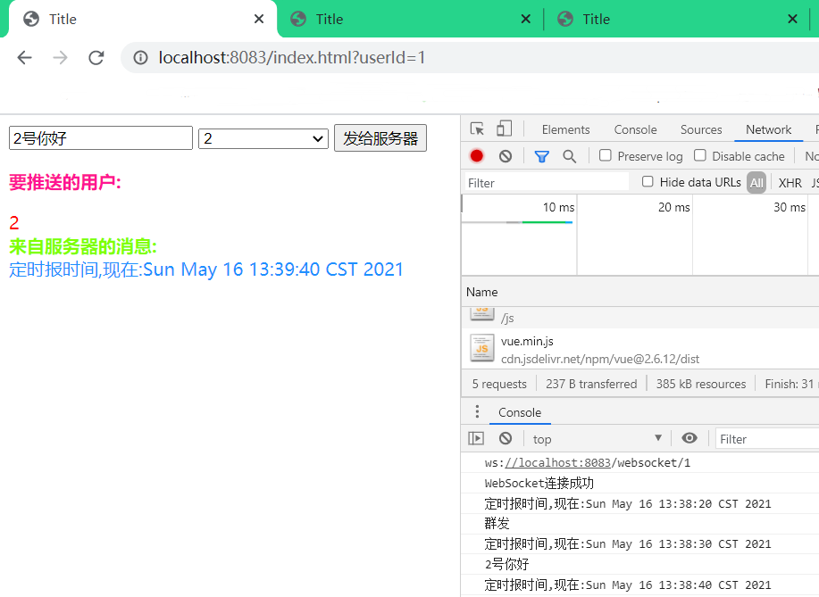
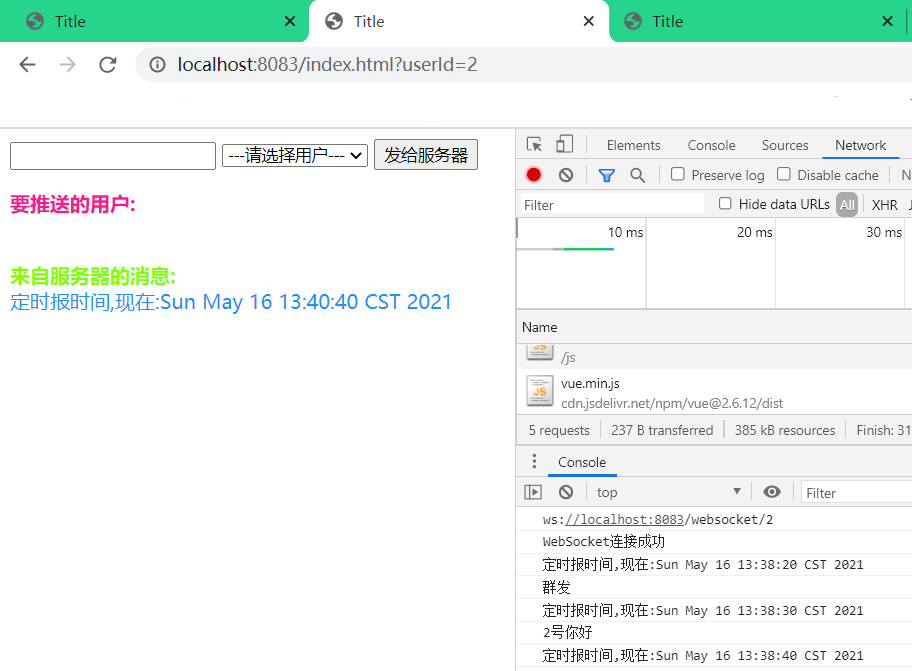
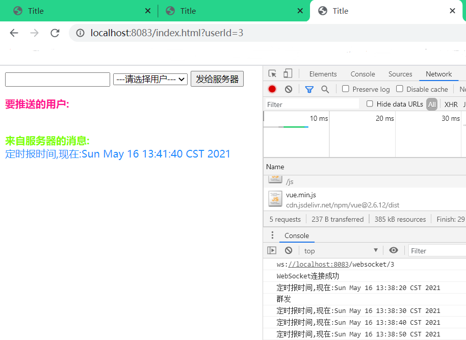

# WebSocket搭配RabbitMQ实现分布式广播或定点推送消息

## 代码指引

- javascript连接websocket（websocket.js）

``` javascript
function createWebSocket() {
    let host = window.location.host;
    userId = GetQueryString("userId");
    wsUri = "ws://" + host + "/websocket/" +userId;
    console.log(wsUri);
    try {
        wsObj = new WebSocket(wsUri);
        initWsEvent();
    } catch (e) {
        setMessageBody("创建失败:"+e);
    }
}
```

- RabbitMQ发布业务消息（SendMessageServiceImpl.java）

``` java
@Override
public String send(MsgDTO msgDTO) {
  String message = msgDTO.getMsg();
  if (StringUtils.hasText(message)) {
    String msg = JSON.toJSONString(msgDTO);
    msg = msg.replace("\\t","").replace("\\n","");
    amqpTemplate.convertAndSend(RabbitConfig.FANOUT_EXCHANGE,"",msg);
    return ResultEnum.SEND_SUCCESS.getTitle();
  }
  return ResultEnum.SEND_NULL.getTitle();
}
```

- RabbitMQ监听业务消息（RabbitReceiver.java）

``` java
@RabbitHandler
@RabbitListener(queues = "ws_queue")
@OnMessage
public void WsReceiver(String msg) throws IOException {
  log.info("Ws已接收到消息---"+msg);
  JSONObject object  = JSON.parseObject(msg);
  MsgDTO msgDTO = JSON.toJavaObject(object, MsgDTO.class);
  sendMessageService.sendToUser(msgDTO);
}
```

- WebSocket实现对用户发送消息的最终业务（SendMessageServiceImpl.java）

``` java
@Override
public void sendToUser(MsgDTO msgDTO) {
  List<String> persons = msgDTO.getPersons();
  String message = msgDTO.getMsg();
  if (!StringUtils.hasText(message)) {
    return;
  }
  if (ObjectUtils.isEmpty(persons)) {
    WebSocketEndPoint.batchSend(message);
    return;
  }
  WebSocketEndPoint.sendToUser(persons,message);
}
```

- 从网页推送消息到服务器转发（vue.html）

``` vue
let vm = new Vue({
    el: "#app",
    data: {
        selected: '',
        sendBtn: "发给服务器",
        messageTitle: "来自服务器的消息",
        selectedTitle:"要推送的用户",
        opList:[1,2,3,4,5,6]
    },
    methods: {
        sendMessageBody: function () {
            //如果指定发送对象就定点推送，如果没有则群发
            let personList=this.selected!==''?[userId,this.selected]:[];
            let data = {
                "persons": personList,
                "msg": $('#send-body').val()
            };
            wsObj.send(JSON.stringify(data));
        },
    },
    mounted(){
        createWebSocket();
    }
});
```

## 测试

- postman发送请求执行定点推送,目标id为1和2



- userId为1和2的都收到了消息





- userId为3的并没有收到消息



## Vue版

- 定点与群发






